# Dockerized 3-Tier Application (React + Node.js + Go + PostgreSQL)
# Project Overview
- This project shows a Dockerized 3-tier application built with React, Node.js, Go, and PostgreSQL. Each service runs in an isolated Docker container and communicates through an internal Docker network and all containers are managed using Docker Compose.
- The project follows industry-style Docker practices such as multi-stage builds, dependency caching, optimized image layers, and running containers as non-root users for improved security.
- Different Docker Compose configurations are used for development, testing, debugging, and production, enabling consistent workflows across different environments.

  ## - Application Architecture:
  - **Presentation Layer:** Handles the user interface and communicates with backend APIs.
    - Technology used: **React frontend**
  - **Application Layer:** Contains the business logic and API services.
    - Technology used: **Node.js and Go backend API's**
  - **Data Layer:** Responsible for data storage and retrieval.
    - Technology used: **PostgreSQL database**

    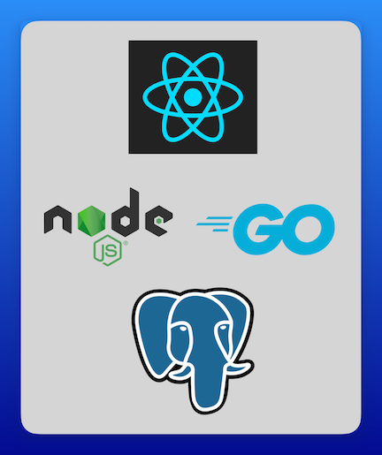

 
  ## - Project Output:
  The Application retrieves the current date and time from the PostgreSQL database through the backend services and displays it in the frontend.

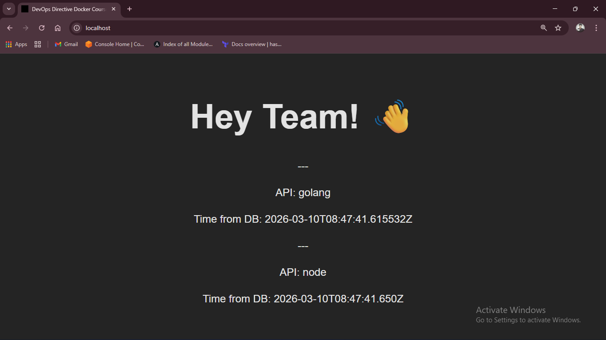

  ## - Docker Concepts Used For Image Optimization
  - Using specific base image versions
  - Layer caching optimization by copying dependency files first
  - Using cache mounts to speed up Install of Existing dependencies
  - Multi-stage Docker builds
    - build stage
    - development stage
    - production stage
  - Running containers with a non-root user
  - Environment variable configuration
  - Using .dockerignore to avoid unnecessary files being copied in to the image

  ## - Image Optimization Results
  - **Node-image-optimization**

  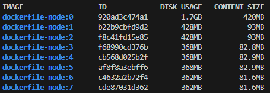

  - **Golang-image-optimization**

  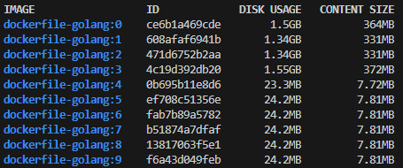

  - **React-image-optimization**

  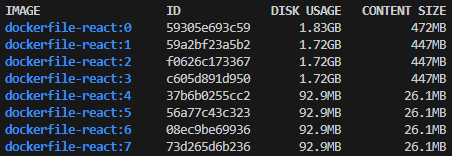

   | Service  | Before Optimization | After Optimization |
 | -------- | ------------------- | ------------------ |
 | Node API | 1.7 GB            | 362 MB            |
 | Go API   | 1.5 GB            | 24.2 MB           |
 | React    | 1.83 GB           | 92.9 MB           |

  ## - Docker Compose Environments
   | Compose File             | Purpose                 |
 | ------------------------ | ----------------------- |
 | docker-compose-dev.yml   | Development environment |
 | docker-compose-prod.yml  | Production setup        |
 | docker-compose-test.yml  | Running tests           |
 | docker-compose-debug.yml | Debugging service       |

# Running the Project
### I) Clone this Project
 ```
 git clone https://github.com/SHANKAR-REGATI/React-Node-Golang-Postgresql-Docker-Web-Application.git
 ```
### II) Run Application In Production Environment
```
docker compose -f docker-compose-prod.yml up --build -d
```
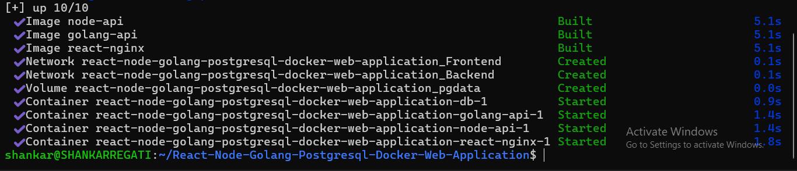
  - ### Verify it
    ### I) React App
    ```
    http://localhost:80
    ```
    
    
    ### II) Node Api
    ```
    http://localhost:3000
    ```
    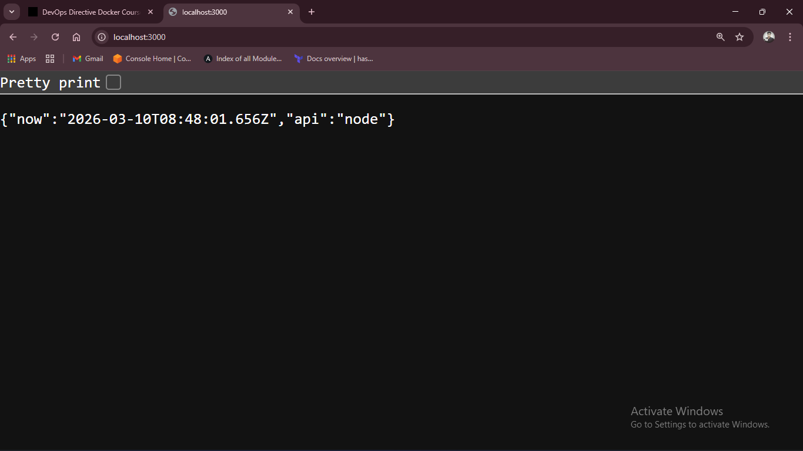

    ### III) Go Api
    ```
    http://localhost:8080
    ```
    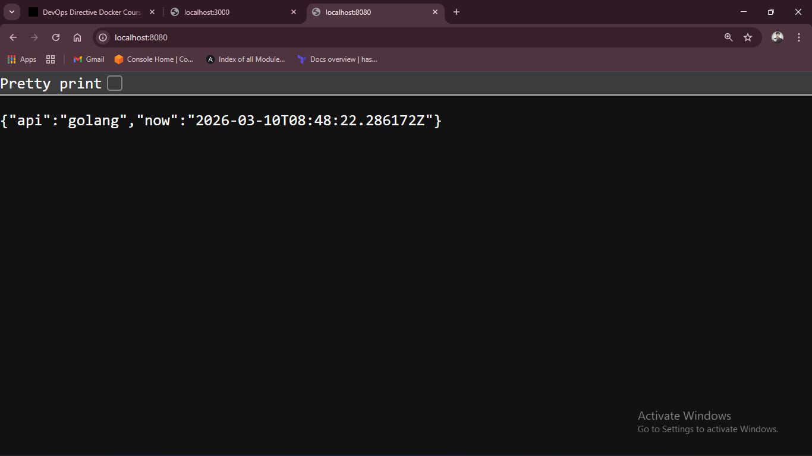
    
  -  **To Stop and remove Containers**
     ```
     docker compose -f docker-compose-prod.yml down -v
     ```
     > **NOTE - Using -v flag to remove the created volumes**
     
     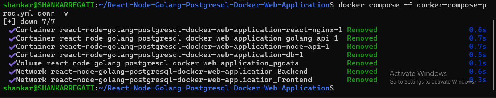

### III) Run Application In Development Environment
```
docker compose -f docker-compose-dev.yml up --build -d
```
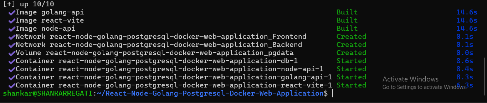
  - ### Verify it
    ### I) React App in development mode
    ```
    http://localhost:5173
    ```
    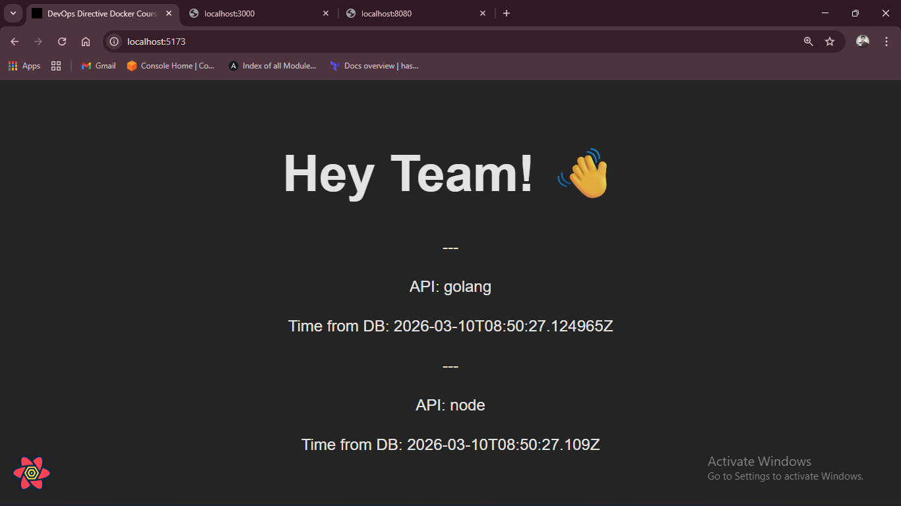
    
    ### II) Node Api
    ```
    http://localhost:3000
    ```
    ### III) Go Api
    ```
    http://localhost:8080
    ```
    > **NOTE - Now the Changes made in code will be reflected automatically in to application running inside container and there is no need of starting and stopping containers as and when code changes.**
     > 
     > **NOTE - Used bind mounts on source code to have Hot Reloading.**

  -  **To Stop and remove Containers**
     ```
     docker compose -f docker-compose-dev.yml down -v
     ```
     


### IV) Run Tests
  - **Test for Node.js Api**
     ```
     docker compose -f docker-compose-test.yml run --build node-api
     ```
     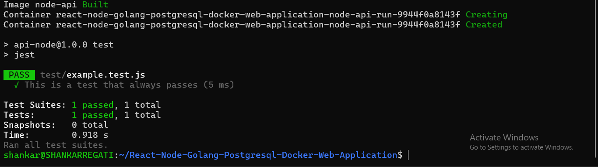
  - **Test for Go Api**
     ```
     docker compose -f docker-compose-test.yml run --build golang-api
     ```
     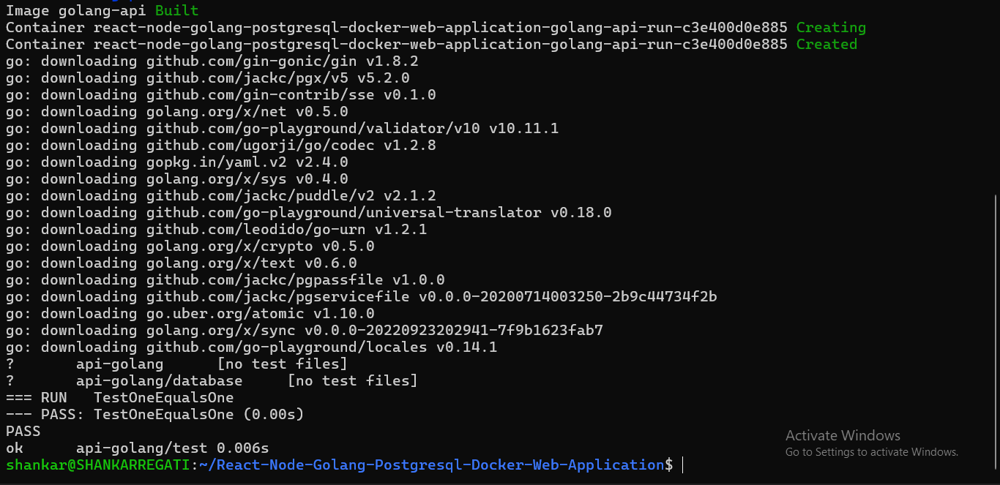
    
     > **NOTE - Once the Test is Done, Container Exits Automatically.**
  - To Delete the Anonymous Containers created for testing purpose
     ```
     docker container prune
     ```
     > **NOTE - Above Command Deletes all unused containers**
### V) Run Application with Debugging service for troubleshooting during Development
```
docker compose -f docker-compose-dev.yml -f docker-compose-debug.yml up --build -d
```
  -  **To Verify Debuggers are running in respective ports**
     ```
     nc -zv localhost 9229 && nc -zv localhost 4000
     ```
     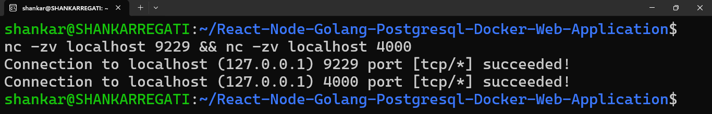
  -  **To Stop and remove Containers**
     ```
     docker compose -f docker-compose-dev.yml down -v
     ```


